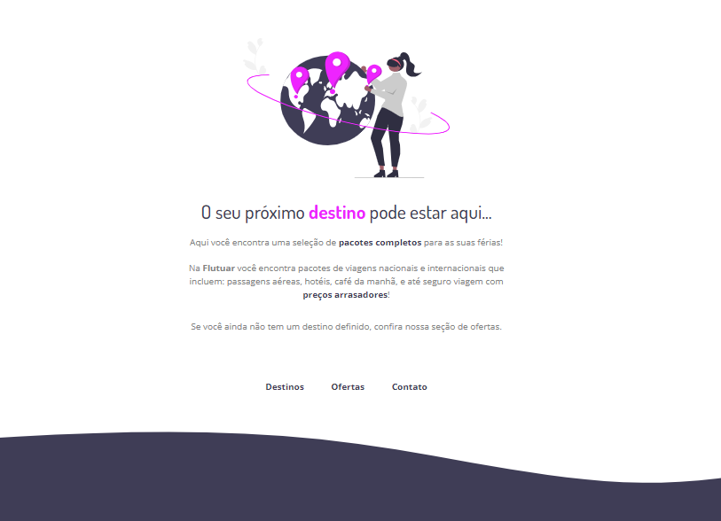

<h1 align="center"> Pacotes de Viagem </h1>
 

  

## 🚀 Tecnologias

Esse projeto foi desenvolvido com as seguintes tecnologias:

- HTML e CSS
- Git e Github
- Figma

## 💻 Projeto

Esse projeto foi desenvolvido para treinamento de estilização e posicionamento.

- [Acesse o projeto finalizado, online](https://github.com/Eduardo-SSoares/Pacotes-Viagem)

## 🔖 Layout

Você pode visualizar o layout do projeto através [DESSE LINK](https://www.figma.com/file/l0aBf2Qi3v6e5HdCaafbNw/Projeto01-Extra-Copy?fuid=1286446084273033097). É necessário ter conta no [Figma](https://figma.com) para acessá-lo.